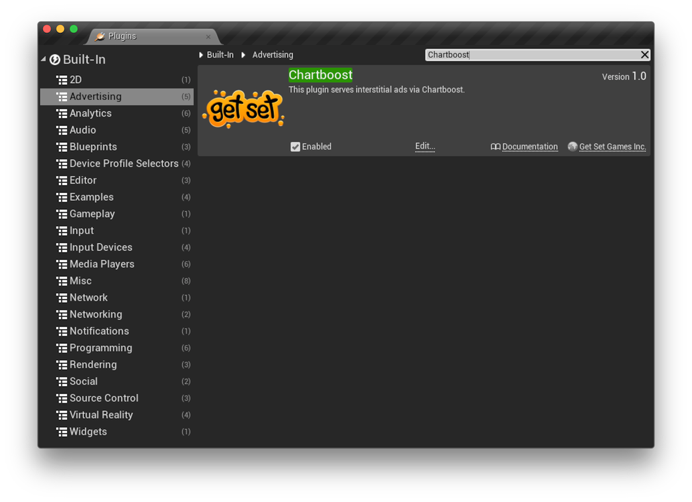
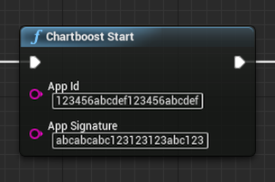
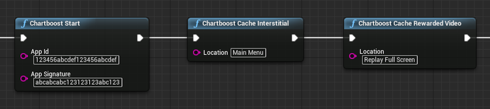
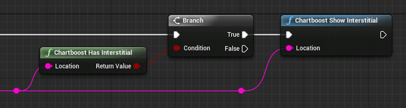
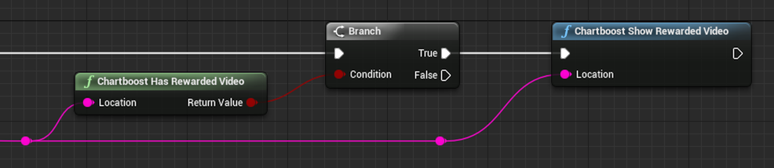
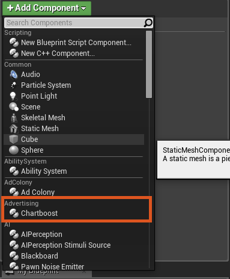
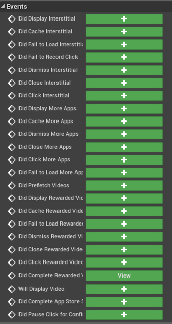
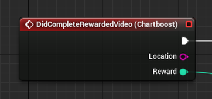

# Chartboost
A plugin for Unreal Engine 4 that integrates Chartboost's SDK and makes its functionality available in blueprints.

- Supported platforms: iOS
- SDK Version: 5.4.0

## Setup

### Integration

There are a couple of different ways to integrate this plugin into your project. You can include it in your fork of the UE4 engine or you can include it in a single UE4 code-based project if you like.

#### In your engine

This method includes the plugin in your fork of the UE4 engine. It allows you to use the plugin in either code or blueprint-based projects that are created with your fork of the engine. It assumes you have already cloned the UE4 engine to a directory on your machine.

1. Clone this repo to a subfolder of your engine called /Engine/Plugins/Chartboost folder. Optionally, you can add it as a submodule.
2. Run the GenerateProjectFiles script in the Engine root.
3. Open your engine project file and build the editor.

#### In your code project

This method includes the plugin in a single code-based project. This can be done on any code-based project that is created using the Github source engine or the one provided by Epic via the launcher.

1. Clone this repo to a subfolder in your project called /Plugins/Chartboost.
2. Open your project. You will be prompted to build missing modules.
3. Select Yes to rebuild now.

### Enable the Plugin

Ensure that the plugin is enabled:

1. In the editor, select Plugins from the Window menu.
2. Search for the plugin called Chartboost. It's in the Advertising category.
3. Check the Enabled checkbox on the plugin. You may have to restart the editor after this step.

### Add the Chartboost Start Function

Add the `Chartboost Start` blueprint function somewhere early in your game's execution. We use it in our Game Instance's Init event. You could also use it in the Application Lifecycle component's Foreground event or in your first scene's Begin Play event. The key here is to run this function before any other Chartboost function.

## Caching Ads

You can cache ads using the Chartboost Cache functions, like so:

## Showing Ads

You can check if an interstitial ad is cached and ready to show by using the `Chartboost Has Interstiital` function. If one is available, you can show it using the `Chartboost Show Interstitial` function. If you run the Show function without checking using the Has function first, an interstitial will display when it is available.

Similarly, you can check if a rewarded video is available using the `Chartboost Has Rewarded Video` function and show it using the `Chartboost Show Rewarded Video` function.

## Responding to Events

You can respond to the delegate callbacks that the Chartboost SDK sends by adding the Chartboost component to an actor in your scene.

Click on the component and the available events will display in the blueprint Details pane:

This allows you to respond to events such as when a rewarded video completes. This is where you can award the player their reward for watching the video.

